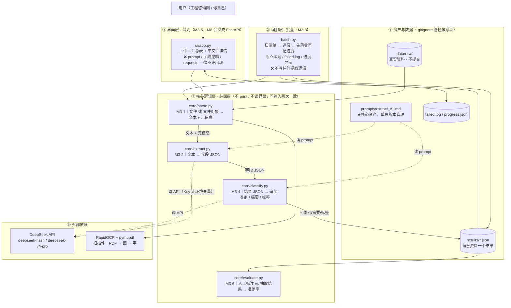
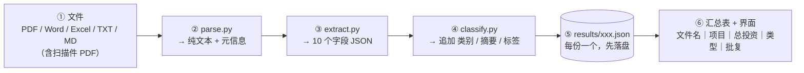

# 工程资料智能整理器

> **工程资料智能整理器** —— 把一堆格式混乱的工程资料（PDF / Word / Excel / 扫描件），变成结构化、可分类、可检索的信息。
> 我做这个是因为我自己就是用户：8 年工程咨询，每个项目几十份资料，想查"这个项目总投资多少"要翻五六个文件。
> **效果**：30 份真实资料评测，最严口径下字段抽取准确率 **53.4%（【演示值】——标准答案为 AI 标注、非人工，详见下方「效果 / 评测口径」）**，电子 52.7% / 扫描件 54.5%，资料类型 86.7%；扫描件类资料准确率较低，**建议人工复核**。
> **[点这里试用公网 Demo](https://project-doc-organizer-fdgxusxmhjovpyx9rwrgq5.streamlit.app/)**
>
> 💡 免费档部署若一段时间没人访问会休眠；**如果它睡着了，你点一下这个按钮就唤醒了，大概等 30~60 秒。**

---

## 业务价值

把散落、格式不一的工程资料，变成结构化、可分类、可检索的字段化信息；我自己（工程咨询岗）就是第一用户。

量化 KPI：

* **单份关键参数提取**：手工翻 5~6 个文件、约 30 分钟 → 上传后约 10 秒出结构化结果；
* **多项目批复情况横向对比**：手工整理约 1 天 → 自动汇总表，分钟级；
* **新同事项目交接**：口头讲 + 传一堆文件 → 一份整理好的结构化清单直接给。

> FDE 视角：甲方资料员 / 项目经理每天要找"总投资、批复状态、建设单位"等参数，本工具让他们每天少翻几小时文件。

---

## 字段清单

| 字段名 | 类型 | 单位 | 说明 |
| - | - | - | - |
| 项目名称 | 文字 | — | 项目全称 |
| 项目地点 | 文字 | — | 建设地点 |
| 项目规模 | 文字 | — | 占地面积/建筑总面积/床位数/其他 |
| 总投资 | 数字 | 万元 | 批复/估算/概算总投资 |
| 建设期 | 数字 | 月 | 计划建设周期 |
| 建设单位 | 文字 | — | 业主单位 |
| 设计单位 | 文字 | — | 图纸编制单位 |
| 施工单位 | 文字 | — | 工程实施单位 |
| 监理单位 | 文字 | — | 监理单位 |
| 编制单位 | 文字 | — | 报告/文件编制方 |
| 文件日期 | 日期 | — | 文件盖章签字落款日期 |
| 资料类型 | 分类 | — | 合同/可研报告/初步设计/会议纪要/招标文件/设计说明/其他 |
| 关键摘要 | 文字 | — | 2~3 句关键信息摘要 |

---

## 分类标准

| 类别 | 定义（什么算这一类） | 易混案例 & 归属 |
| - | - | - |
| 合同 | 甲乙双方约定权利义务的协议文本（施工/采购/服务等） | 「框架协议」无具体标的 → 其他 |
| 可研报告 | 可行性研究报告：立项论证文件，含投资估算、效益分析 | 「项目建议书」更早阶段、内容相近但非可研 → 其他 |
| 初步设计 | 初步设计文件：含设计说明、图纸、概算等整套 | 「施工图设计」属后续阶段 → 设计说明（或 其他） |
| 会议纪要 | 会议讨论与决议的记录 | 纪要里附带的变更说明 → 仍归会议纪要 |
| 招标文件 | 招标公告、招标文件（含评标办法、投标邀请等） | 「中标通知书」是结果而非招标过程 → 其他 |
| 设计说明 | 图纸 / 设计配套的设计说明文本（区别于整套初步设计） | 纯文字无设计内容 → 其他 |
| 其他 | 不能归入上述六类的资料 | 占比上限 ≤10% |

> 终极自测：拿一份真实资料问"它属于哪类"，答不出 = 标准没定完。

---

## 效果 / 评测口径（诚实声明）

| 指标 | 数字 |
| - | - |
| 评测集规模 | **30 份**真实工程资料（扫描件 10 + 电子 20，覆盖 pdf / docx / xlsx） |
| 判定口径 | 按字段判；字符串严格相等；数字容差 0.0；日期归一化；部分匹配不算对（**最严一档**） |
| **总体字段准确率** | **53.4%**（111 / 208 格，【演示值】） |
| 电子资料 | 52.7% |
| 扫描件 | 54.5% |
| 资料类型（分类） | 86.7% |
| 主要错因 | OCR 漏识别 36.1% + AI 幻觉 33.0%（原文无内容却编了一个） |

**怎么变成"真数字"**：人工重标 → 删掉每份 gold 里的 `_标注来源` → 重跑 `python core\evaluate.py`。真数字出来前，公网 Demo / 演示只讲**方法**，不讲分数。

---

## 快速开始

```powershell
# 1) 拉代码 + 建环境（依赖已 pin 在仓库根 requirements.txt）
git clone <你的仓库地址> project-doc-organizer
cd project-doc-organizer
python -m venv .venv
.\.venv\Scripts\Activate.ps1
pip install -r requirements.txt

# 2) 配 Key（只走环境变量，代码里不写明文）
#    Windows PowerShell：
$env:DEEPSEEK_API_KEY = "你的key"
#    （或复制 .env.example 为 .env 填入后，app.py 经 load_dotenv 自动读取；云端走 Streamlit Secrets）

# 3) 跑起来
streamlit run ui/app.py
#    浏览器自动打开 http://localhost:8501 ，上传一份资料即可看到结构化结果
```

> 仅支持本地运行的最小三步；公网 Demo 链接见顶部（Step 5 部署后填入）。

---

## 架构

> 完整版（含数据流、分层职责表、目录结构、部署图）见课程仓库 `03_架构图.md`。


### 一份资料的数据流



---

## 技术选型

**原则**：直接调用 LLM API，不微调 / 不训练模型。

| 用途 | 选择 | 为什么 |
| - | - | - |
| PDF 解析 | `pdfplumber` | 表格提取 + 可视化调试好；**避开 `pymupdf` 的 AGPL v3 商用授权风险**（仅用其 `fitz` 做扫描件渲染成图，不解析文本） |
| Word 解析 | `python-docx` | 只管 `.docx`（老 `.doc` 不支持） |
| Excel 解析 | `openpyxl` | 只管 `.xlsx` / `.xlsm`（老 `.xls` 不支持） |
| 扫描件 OCR | `RapidOCR` | 轻量、免 PaddlePaddle 框架、部署最省事（曾试 Tesseract 丢金额小数点） |
| 界面框架 | `Streamlit` | 薄壳；`parse.py` 吃文件对象，不当路径落盘 |
| LLM 模型 | `deepseek`（API） | 直接调 API；Key 只走环境变量 |
| 批量编排 | `core/batch.py` | 薄壳编排 + 断点续跑 + 失败留痕，不写业务逻辑 |

---

## 不做什么

| 不做 | 为什么不做 |
| - | - |
| 用户登录 / 权限系统 | 单人本地工具，无多用户场景；加权限不产生价值 |
| 数据库持久化 | 先用 JSON 文件存，数据库是 M8 才学的内容 |
| 多用户并发 | 单人使用，不做并发设计 |
| 精美前端 / 移动端适配 | 界面只是薄壳，"核心价值在逻辑层"，能看就行 |
| 在线编辑 / 协同批注 | 只读展示，不提供编辑；超出"整理"边界 |
| 支持所有文件格式 | 只做 PDF / Word / Excel / TXT / Markdown / JPG / PNG（老 `.doc`/`.xls` 不支持） |
| 微调 / 训练模型 | 直接用 API，不训模型 |
| 涉密资料上公网 / 云存储 | 工程资料数据不出域、组织主权要求，必须本地化 |

---

## 已知限制

- 免费档（Community Cloud）12 小时无流量会休眠，首次打开需 30~60 秒冷启动——演示前先预热；
- 数据在美国服务器，若客户要求"数据不出境"须换私有化部署（VPS / 内网 / 信创 + 本地模型或内网 API 网关 + Docker 一键交付）；
- 内存约 2.7GB，大文件（几十 MB）可能无警告重启——已主动调小 `maxUploadSize` 并给友好提示；
- 不支持老 `.doc` / `.xls` 格式（界面也不会出现这两类）；
- 扫描件准确率较低，关键数字**建议人工复核**；
- **当前准确率仍是【演示值】（AI 标注，非人工）**，真人标注前的分数只讲方法、不讲分数；
- 不支持自定义域名（客户不接受 `xxx.streamlit.app` 时需换方案）。
