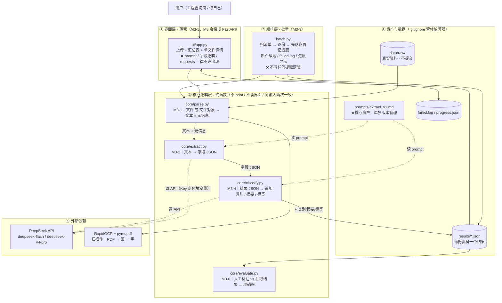
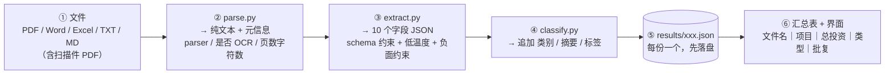
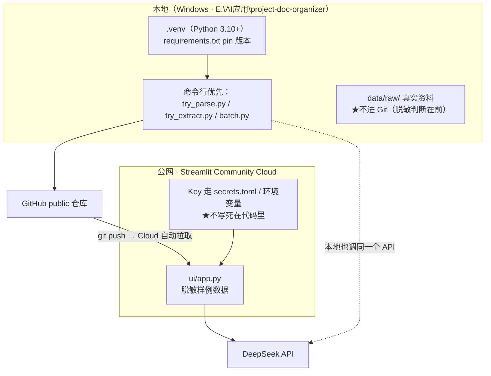

# M3 项目架构图 · 工程项目资料智能整理器

> **本文件干什么**：一张图说清这个项目的**分层、数据流、文件归属、外部依赖**。
> **用在哪**：M3-0 定技术选型时先认图 → 每关动手前对照「我这一步落在哪一层」→ **M3-7 Step 4 画架构图时以本图为底稿**（贴进 README 的「## 架构」小节）。
> 生成：2026-10-05 ｜ 学员：zn ｜ 带教：小乌
> 对应仓库：`E:\AI应用\project-doc-organizer`（GitHub 同名 public 仓库）

---

## 一、总览架构图（分层 + 依赖）



**怎么读这张图**：实线 = 数据流向（`P → E → C` 之间的串联由**界面层或编排层**发起，`core/` 内部三个模块**互不调用**）；虚线 = 读资源 / 调外部 API。

> 🔑 **一眼要看出来的那件事**：`ui/app.py` 除了「收文件 + 调函数 + 显示」什么都不做——**删掉 `ui/` 整个目录，`core/` 照样能跑**；`batch.py` 也一样，它只是个编排壳。

---

## 二、数据流（一份资料从进到出）



| 环节 | 输入 → 输出 | 出自 | 关键约束 |
|---|---|---|---|
| ① 文件 | 五类格式 / 文件对象（Streamlit 上传的是 `BytesIO`） | — | 扫描件是常态，不是例外 |
| ② 解析 | 文件 → 文本 + 元信息 | M3-1 `core/parse.py` | 三态分开：成功 / 成功但空 / 解析失败 |
| ③ 提取 | 文本 → 字段 JSON | M3-2 `core/extract.py` | 字段清单 key 不多不少；原文没有就 `null`，不许编 |
| ④ 分类 | 结果 JSON → + 类别 / 摘要 / 标签 | M3-4 `core/classify.py` | 受约束枚举，与 M3-0 分类标准一致 |
| ⑤ 落盘 | 每份一个 JSON | M3-3 `batch.py` | **先落盘再记进度**（断点续跑的前提） |
| ⑥ 汇总 | 全部 JSON → 表 / 界面 | M3-3 + M3-5 | 汇总表列从「甲方关心什么」倒推 |

---

## 三、分层职责表（哪层该有什么、不该有什么）

| 层 | 文件 | 出自 | 只回答的一个问题 | 红线（出现即越界） |
|---|---|---|---|---|
| **界面层** | `ui/app.py` | M3-5 | 「怎么让不懂技术的人 30 秒看懂结果」 | ❌ prompt ❌ `requests` ❌ 字段拼装 ❌ 解析 |
| **编排层** | `batch.py` | M3-3 | 「50 份怎么一份不落地跑完，且结局可追溯」 | ❌ 临时拼 prompt ❌ 改字段 ❌ 判类别 |
| **核心层** | `core/parse.py` | M3-1 | 「这个文件里有什么字」 | ❌ 提取字段 ❌ 分类 ❌ `print` |
| **核心层** | `core/extract.py` | M3-2 | 「这段文本里的 10 个字段是什么」 | ❌ 读文件 ❌ 调 `parse.py` ❌ `print` |
| **核心层** | `core/classify.py` | M3-4 | 「这份资料属于哪类、关键信息是什么」 | ❌ 碰解析 ❌ 碰字段提取 ❌ 碰批量 |
| **核心层** | `core/evaluate.py` | M3-6 | 「抽得到底准不准」 | ❌ 用 AI 生成的答案当标准 ❌ 用模型自报置信度判对 |
| **资产** | `prompts/extract_v1.md` | M3-2 | 「这段 prompt 为什么这么写」 | ❌ 把 prompt 塞进 `extract.py` 当字符串 |

> ⚠️ **三处必须一致**：README 字段清单 / `prompts/extract_v1.md` / `extract.py` 的 `DEFAULT_FIELDS`。改一处，另两处同步，且**评测要重跑**。

---

## 四、目录结构（M3 全部跑完之后）

```
project-doc-organizer/
├── README.md                  ← 四件事（字段清单/分类标准/技术选型/评测方式）+ 业务价值 + 不做什么 + 三条硬规矩 + 架构图
├── requirements.txt           ← pin 版本，本地与云端唯一契约（仓库根，不是 ui/ 里）
├── .gitignore                 ← .env / secrets.toml / data/raw/* / .venv/
├── .env                       ← DEEPSEEK_API_KEY（本地；不提交）
├── .streamlit/secrets.toml    ← 云端 Key（不提交）
│
├── core/                      ★核心逻辑层（纯函数，删掉 ui/ 照样能跑）
│   ├── parse.py               M3-1  文件/文件对象 → 文本 + 元信息
│   ├── extract.py             M3-2  文本 → 字段 JSON
│   ├── classify.py            M3-4  结果 JSON → + 类别/摘要/标签
│   └── evaluate.py            M3-6  人工标注 vs 抽取结果 → 准确率
├── prompts/                   ★核心资产，单独版本管理
│   ├── extract_v1.md          M3-2
│   └── classify_*.md          M3-4
├── ui/
│   └── app.py                 M3-5  Streamlit 薄壳（入口：ui/app.py）
│
├── batch.py                   M3-3  批量编排（不含任何提取逻辑）
├── try_parse.py               M3-1  命令行验证（可以先跑通再接界面）
├── try_extract.py             M3-2  命令行验证
│
├── data/raw/                  真实资料（★不提交，.gitkeep 占位）
├── results/                   每份一个结果 JSON（M3-4 / M3-6 的原料）
├── failed.log                 失败清单：路径 + 阶段 + 原因
├── progress.json              断点续跑的进度状态
│
├── docs/
│   ├── 01_需求清单.md          M3-0
│   ├── 02_技术选型.md          M3-0（每条「选 A 不选 B，因为…」+ 承认局限 + 真取舍）
│   ├── 03_对照记录.md          M3-1  不同解析路径质量差多少
│   ├── 04_稳定性对照记录.md    M3-2  同一份跑 10 次
│   ├── 05_断点续跑验证.md      M3-3  真的中断过再续上的实证
│   ├── 07_评测口径.md          M3-6  准确率分子/分母
│   └── （M3-4 对照记录 / M3-7 使用说明按编号顺延）
└── tests/                     临时脚本归宿（`_try_*.py` 要么删、要么移进来）
```

---

## 五、运行时与部署（本地 vs 公网）



| 部署前四查（M3-7 坑 8） | 要求 |
|---|---|
| `requirements.txt` 在**仓库根** | 不是 `ui/` 里 |
| **只有一个** `.streamlit/config.toml` | 多份会冲突 |
| 代码已全部 push | Cloud 从 GitHub 拉 |
| 入口路径记下来 | `ui/app.py`（在子目录要写全路径） |

---

## 六、三条硬规矩（挂在架构图边上）

| # | 规矩 | 对应层 |
|---|---|---|
| 1 | 核心逻辑必须是**纯函数**（不 print、不读界面、同输入两次一致） | `core/*` |
| 2 | **界面层不许写业务逻辑**（换 FastAPI 只改 `app.py`） | `ui/app.py` |
| 3 | 每个里程碑**先命令行跑通，再接界面** | `try_*.py` 先行 |

**明确不做（范围控制）**：登录/权限 ｜ 数据库持久化（先用 JSON）｜ 多用户并发 ｜ 精美前端 ｜ 移动端 ｜ 在线编辑 ｜ 五类以外的格式 ｜ 微调模型。

---

## 七、里程碑 → 产出物对照（一眼定位"我现在在哪"）

| 里程碑 | 落点（改哪个文件） | 硬判据 |
|---|---|---|
| M3-0 项目启动 | `README.md`、`docs/01`、`docs/02`、目录骨架 | 四件事定死，之后不改 |
| M3-1 文件解析层 | `core/parse.py` + `try_parse.py` + `docs/03` | 五类各 ≥1 份 + **扫描件读出字** |
| M3-2 AI 识别层 | `core/extract.py` + `prompts/extract_v1.md` + `try_extract.py` + `docs/04` | JSON 合法率 ≥9/10 |
| M3-3 批量与兜底 | `batch.py` + `results/` + `failed.log` + `progress.json` + `docs/05` | ≥50 份 + 断点续跑 |
| M3-4 分类摘要标签 | `core/classify.py` + `prompts/classify_*` | 人工抽查 10 份对 ≥8 |
| M3-5 展示层 | `ui/app.py` | `app.py` / 核心层行数比 < 0.5 |
| M3-6 准确率评测 | `core/evaluate.py` + `docs/07` + 评测集 | **准确率 ≥80%**（人工标注） |
| M3-7 文档与上线 | README 补齐 + 架构图 + 公网 Demo + 演示脚本 | 链接能开 + **3 分钟演示** |

> 🔑 **面试可讲的一句**：**"这个项目分三层——界面是薄壳、批量只做编排、核心逻辑全是纯函数，所以项目2 的 RAG 直接 import 了我的 `parse.py`，一行没改。"**
